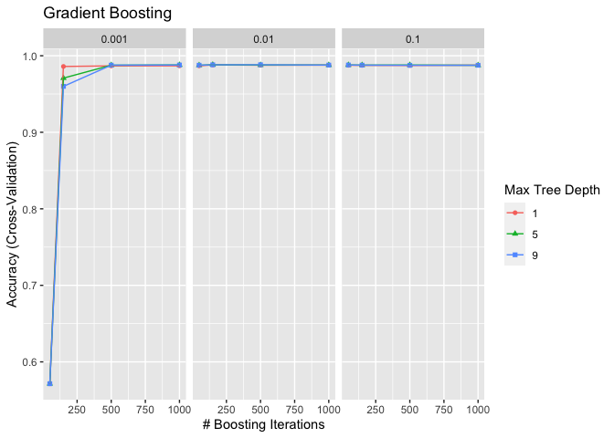
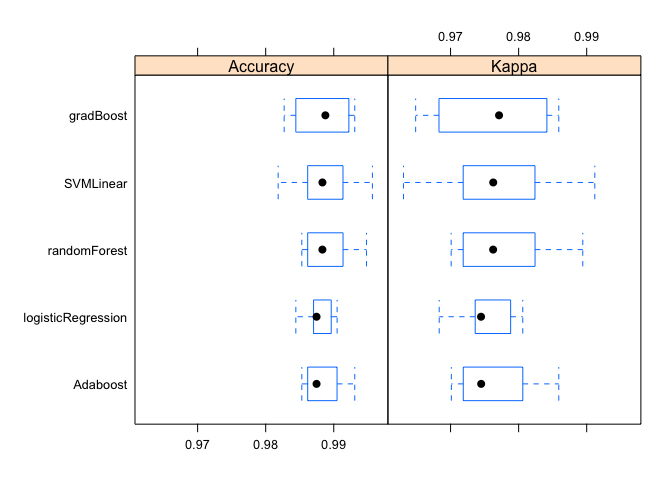
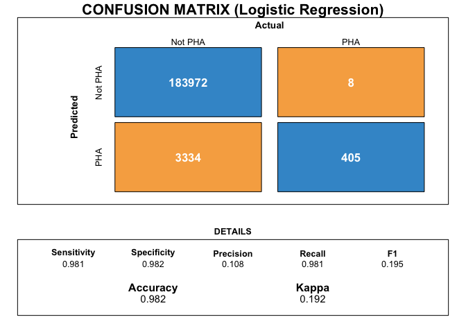
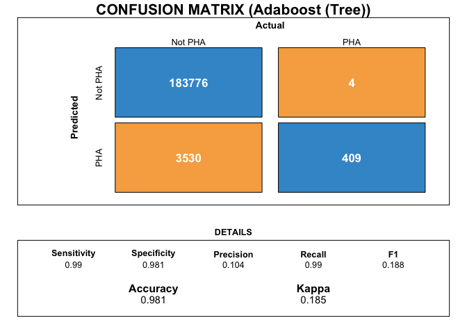

*revised 8/4/2021 on a different laptop (MBP vs old Dell i7). Should work with r4.0 and later.*


# Predicting Dangerous Asteroids

This project was done for a Data Mining and Machine Learning course as part of my Master's program. I selected the topic and it was approved based on my proposal, which contained an outline of the objectives and methods likely to be used. It was intended that this run on Kaggle and be submitted as a notebook. However, the attempt to do this was cut short because I ran into issues around the use of the caret package. So it never was submitted. I'd likely move to python if I head down that route.

Data Source: https://www.kaggle.com/sakhawat18/asteroid-dataset (saved it as 'dataset.csv')
From this source, data has been obtained through NASA's Jet Propulsion Laboratory: Small Body Database
This analysis answers a task question from the data maintainer.

Additionally, when seeking relief from computation cost through downsampling, our data was sparse enough as pre-processed (without addressing near-zero-variance predictors programmatically) to result in fold validation errors because we had folds where some variables had near or zero variance (throws an error in models like gbm). So, we turned to the caret package (and more) to leverage pipelines for addressing some of these stumbling blocks.

In the import stage a few libraries not used are imported. My intent was to test serial vs parallel execution within the CV for each of the model training runs. Didn't get that far, but the imports are there. The Caret documentation has the details on how one would do that via 'doParallel' style execution. This wasn't mission critical to this project.

## Step 1: Initial Pre-Processing

The preprocessing to begin transformation from the raw data with some cleanup given prior knowledge of the subject matter, and required some additional research. For example, the name of a asteroid was taken not to be a characteristic of its status (pha vs not pha - *Potentially Hazardous Asteroid*). There is a data dictionary accompanying this notebook in the repository, and I encourage looking at that for some context.


```r
# read in data
asteroids<- read.csv('dataset.csv')

# remove identifier columns & some zero variance or highly variable and ancillary columns
asteroids <- asteroids[, !names(asteroids) %in% c("id", "spkid", "name", "full_name", "pdes", "equinox", "orbit_id", "prefix")]


ppAsteroidsManual <- function(df, cols_with_nas = c("H", "diameter", "albedo", "diameter_sigma"), cols_YesNo = c("neo", "pha")){ 
  df_out <- df %>%
      # convert some columns with many NA's to binary response (1 == we have data)
      mutate_at(all_of(cols_with_nas), function(x) case_when(is.na(x) ~ 0, TRUE ~ 1)) %>%
      # convert our non-numeric factor-esque columns to binary response where the former "Yes"("Y") is denoted
      # as 1, else 0
      mutate_at(all_of(cols_YesNo), function(x) case_when(x =="Y" ~ 1, TRUE ~ 0)) %>%
      # last convert to factors and remove any NA vals in the features (~20k rows in src data)
      mutate_at(c(all_of(cols_with_nas), all_of(cols_YesNo)), as.factor) %>%
      mutate_if(is.character, as.factor) %>%
      filter(complete.cases(.))  %>%
  return(df_out)
}
# call the function on the dataset and then rename the target column
asteroids <- ppAsteroidsManual(asteroids)
asteroids$pha <- ifelse(asteroids$pha== 1, "PHA", "Not PHA")
```

#### Train-Test-Split for hold out validation

Implementation using caret because we had some trouble using the prcomp package (apparently this is a common thing based on my web searching). I recognize that some preprocessing happens prior to this step, but it was done intentionally given prior knowledge of the dataset. 


```r
#v2 implementation with caret because i got stuck in the CV looping with -inf values using prcomp....apparently it happens?
set.seed(432)
# create our train and test sets vis a vis a partition
trainIndex <- createDataPartition(asteroids$pha, p = 0.8, list = F, times = 1)
train <- asteroids[trainIndex,]; train$pha <- as.factor(train$pha)
test <- asteroids[-trainIndex,]; test$pha <- as.factor(test$pha)
```


#### Downsampling

Downsampling is critical in this case due to the loading into memory of a large dataset *plus* the class imbalances. Ideally this would be executed during the transformer pipeline, but memory issues occured. Attempted other methods (downSample, ROSE), but SMOTE provided the most consistent results over training runs.

```r
# reference: https://topepo.github.io/caret/subsampling-for-class-imbalances.html
set.seed(42)
smote_train <- SMOTE(pha ~ ., data  = train) 
```

## Step 2: Cross Validation with integrated pre-processing, NZV, PCA

This step runs a grid search on hyperparameters across several models. Near Zero Variance (NZV) and Principal Components Analysis (PCA) performed inside of the cross validation to avoid information leakage (src: https://stats.stackexchange.com/questions/46216/pca-and-k-fold-cross-validation-in-caret-package-in-r). Generally we have a GLM (logistic regression) model as a baseline, with some additional options considered.

NOTE 1: I'd advise not running the training for all models in one shot as it takes significant time (output duration is below). On a MBP (2019) with 16gb ram run time was ~13 minutes. Timing commands left in the block below.

NOTE 2: (02.10.2021) *XG Boost: Linear* was commented out. Issue with the default confusion matrix and its use in base::try in the caret implementation. Used ADAboost instead as the conflicts weren't present.


```r
start <- Sys.time();
# training and preprocessing parameters, including setting up 10 fold cross validation
control <- trainControl(method = "cv", number = 10, preProcOptions = list(thresh=0.85))

# ------------ hyperparameter grids for grid-searching our tuneable models -----------------
gbmGrid <- expand.grid(interaction.depth= c(1,5,9), n.trees = c(50, 150, 500, 1000), 
                       shrinkage = c(0.001,0.01, 0.1), n.minobsinnode = 20)
svmGrid <- expand.grid(cost = c(0.001, .01, .25, 0.5, .75))
rfGrid <- expand.grid(mtry = sqrt(ncol(smote_train)))
adaGrid <- expand.grid(iter = 50,maxdepth = 10,nu = 1)

# ---------------------- training - this is the time/compute intensive step ---------------------
set.seed(777)
# GLM
glmFit <- train(pha ~ ., data = smote_train, trControl = control,
                method = "glm", preProcess = c("scale", "center", "nzv", "pca")) # no tuning parameters
# GBM
gbmFit <- train(pha ~ ., data = smote_train, trControl = control, method = 'gbm',
                distribution = "bernoulli", preProcess = c("scale", "center","nzv", "pca"), 
                verbose = F, tuneGrid = gbmGrid)
# RF
rfFit <- train(pha ~ ., data = smote_train, trControl = control, 
               method = 'rf', preProcess = c("scale", "center","nzv", "pca"), tuneGrid =rfGrid,verbose = F) 
# SVM Linear
svmLinFit <- train(pha ~ ., data = smote_train, trControl = control, method = 'svmLinear2', 
                preProcess = c("scale", "center","nzv", "pca"), tuneGrid = svmGrid)

# ADABOOST Tree
adaFit <- train(pha ~ ., data = smote_train, trControl = control,
                method = 'ada', preProcess = c("center", "scale", "nzv", "pca"),
                tuneGrid = adaGrid)
                      
end = Sys.time()
duration = difftime(end,start, units = 'mins')
sprintf("Start Time: %s, End Time: %s, Duration: %.2f Minutes", start, end, duration)
```

```
## [1] "Start Time: 2021-08-04 13:03:20, End Time: 2021-08-04 13:15:15, Duration: 11.93 Minutes"
```
## Step 3:  Explore results from Cross-Validation. 
This is the final version, but a lot of manual hyperparameter tuning occured. Certainly a different approach than grid search would have been taken if I was starting now, I'd strongly consider genetic or bayesian methods to arrive at optimal parameters. In fact, the gbm and ada methods aside, it is pretty quick to run cross validation on, so more attention to hyperparameters is warranted.


```r
# plotting and exploring results for selected models
ggplot(gbmFit) + ggtitle("Gradient Boosting")
```

<!-- -->

```r
ggplot(svmLinFit) + ggtitle("Support Vector Machine (Linear Kernel)");
```

<!-- -->

```r
# collect resamples
results <- resamples(list(logisticRegression=glmFit, gradBoost=gbmFit, randomForest=rfFit, SVMLinear=svmLinFit,  Adaboost=adaFit))

# initial output of resamples
summary(results)
```

```
## 
## Call:
## summary.resamples(object = results)
## 
## Models: logisticRegression, gradBoost, randomForest, SVMLinear, Adaboost 
## Number of resamples: 10 
## 
## Accuracy 
##                         Min.   1st Qu.    Median      Mean   3rd Qu.      Max.
## logisticRegression 0.9844291 0.9870354 0.9874732 0.9876413 0.9891988 0.9904927
## gradBoost          0.9827139 0.9846485 0.9887693 0.9882458 0.9920052 0.9930856
## randomForest       0.9853068 0.9866007 0.9883319 0.9888508 0.9907143 0.9948142
## SVMLinear          0.9818339 0.9866033 0.9883371 0.9885919 0.9907087 0.9956785
## Adaboost           0.9853068 0.9863872 0.9874732 0.9883329 0.9900543 0.9930856
##                    NA's
## logisticRegression    0
## gradBoost             0
## randomForest          0
## SVMLinear             0
## Adaboost              0
## 
## Kappa 
##                         Min.   1st Qu.    Median      Mean   3rd Qu.      Max.
## logisticRegression 0.9683310 0.9736222 0.9744791 0.9748278 0.9779665 0.9806052
## gradBoost          0.9648692 0.9687496 0.9771229 0.9760693 0.9837100 0.9858982
## randomForest       0.9700864 0.9727195 0.9762543 0.9773005 0.9810923 0.9894237
## SVMLinear          0.9630808 0.9727327 0.9762683 0.9767873 0.9810836 0.9911886
## Adaboost           0.9701164 0.9723018 0.9744973 0.9762437 0.9797348 0.9858982
##                    NA's
## logisticRegression    0
## gradBoost             0
## randomForest          0
## SVMLinear             0
## Adaboost              0
```

```r
bwplot(results)
```

<!-- -->

```r
# the text based confusion matrices on the fitted models.
confusionMatrix(glmFit, positive = "PHA", mode = 'prec_recall')
```

```
## Cross-Validated (10 fold) Confusion Matrix 
## 
## (entries are percentual average cell counts across resamples)
##  
##           Reference
## Prediction Not PHA  PHA
##    Not PHA    56.1  0.2
##    PHA         1.0 42.6
##                             
##  Accuracy (average) : 0.9876
```

```r
confusionMatrix(gbmFit, positive = "PHA",mode = 'prec_recall')
```

```
## Cross-Validated (10 fold) Confusion Matrix 
## 
## (entries are percentual average cell counts across resamples)
##  
##           Reference
## Prediction Not PHA  PHA
##    Not PHA    56.1  0.2
##    PHA         1.0 42.7
##                             
##  Accuracy (average) : 0.9882
```

```r
confusionMatrix(rfFit, positive = "PHA",mode = 'prec_recall')
```

```
## Cross-Validated (10 fold) Confusion Matrix 
## 
## (entries are percentual average cell counts across resamples)
##  
##           Reference
## Prediction Not PHA  PHA
##    Not PHA    56.1  0.1
##    PHA         1.0 42.8
##                             
##  Accuracy (average) : 0.9889
```

```r
confusionMatrix(svmLinFit, positive = "PHA",mode = 'prec_recall')
```

```
## Cross-Validated (10 fold) Confusion Matrix 
## 
## (entries are percentual average cell counts across resamples)
##  
##           Reference
## Prediction Not PHA  PHA
##    Not PHA    56.0  0.0
##    PHA         1.1 42.8
##                             
##  Accuracy (average) : 0.9886
```

```r
confusionMatrix(adaFit, positive = "PHA",mode = 'prec_recall')
```

```
## Cross-Validated (10 fold) Confusion Matrix 
## 
## (entries are percentual average cell counts across resamples)
##  
##           Reference
## Prediction Not PHA  PHA
##    Not PHA    56.1  0.1
##    PHA         1.0 42.7
##                             
##  Accuracy (average) : 0.9883
```
Based on the Boxplot avove, it seems like randomForest and SVMLinear are our best bets in terms of accuracy on the resamples from training.

## Step 4: Validation of model on test data

One thing to note is that the from the cross validation results we see different results. That is because we have run the confusion matrix function on the test data, split prior to downsampling, pre-processing, and grid search cv training. Kappa as an evaluation metric was new to me, so it took a little bit to understand. Ultimately, the important thing to remember was the practical considerations of our predictions. That is, it would be ideal if we avoid classifying an asteroid as not hazardous when indeed it was. These false negatives (aka Type II error) have the potential to be devastating to civilization. As such it seems reasonable to allow for some false positives given that this allowance reduces our overall risk in practical terms.

#### A Nicer Confusion Matrix

I thought it might be nice to generate a more interpretable confusion matrix, and given my level of knowledge during the course of this project, I found this helper function: https://stackoverflow.com/questions/23891140/r-how-to-visualize-confusion-matrix-using-the-caret-package

Some modifications were made for this analysis to make the plots more appropriate to our use case.


#### Confusion Matricies


```r
# references:
#https://epiville.ccnmtl.columbia.edu/popup/how_to_calculate_kappa.html 
#http://standardwisdom.com/softwarejournal/2011/12/confusion-matrix-another-single-value-metric-kappa-statistic/
#https://en.wikipedia.org/wiki/Pearson%27s_chi-squared_test#Test_of_independence

glm_pred <- predict(glmFit, test)
glm_cm <- confusionMatrix(glm_pred, test$pha,positive = "PHA", mode = 'prec_recall')
draw_confusion_matrix(glm_cm, "Logistic Regression")
```

<!-- -->

```r
gbm_pred <- predict(gbmFit, test)
gbm_cm <- confusionMatrix(glm_pred, test$pha, positive = "PHA", mode = 'prec_recall')
draw_confusion_matrix(gbm_cm, "Gradient Boosting")
```

<!-- -->

```r
ada_pred <- predict(adaFit, test)
ada_cm <- confusionMatrix(ada_pred, test$pha, positive = "PHA",mode = 'prec_recall')
draw_confusion_matrix(ada_cm, "Adaboost (Tree)")
```

<!-- -->

```r
rf_pred <- predict(rfFit, test)
rf_cm <- confusionMatrix(rf_pred, test$pha, positive = "PHA", mode = 'prec_recall')
draw_confusion_matrix(rf_cm, "Random Forest")
```

<!-- -->

```r
svm_pred <- predict(svmLinFit, test)
svm_cm <- confusionMatrix(svm_pred, test$pha, positive = "PHA", mode = 'prec_recall')
draw_confusion_matrix(svm_cm, "Support Vector Machine, Linear")
```

<!-- -->

## Step 5: Conclusion

The best model(s) for our purposes as stated above: Random Forest or Support Vector Machine with a linear kernel (SVM Linear). However, given the imbalanced nature of the data all models are technically quite accurate. That's why sensitivity and Type II errors are important given our practical approach (broader than just statistical accuracy). In the confusion matricies, it should be noticed that the strongest sensitivity is achieved with either of these two models and in our test data we only *miss* 1 asteroid in either case. It can be noted that Random Forest edges SVM Linear for overall accuracy, but in practical terms it might not be a significant difference. 

